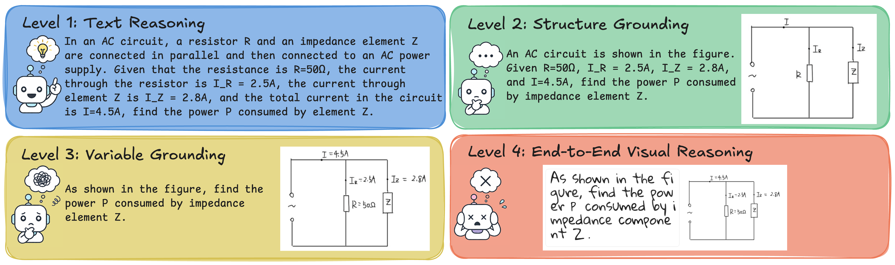
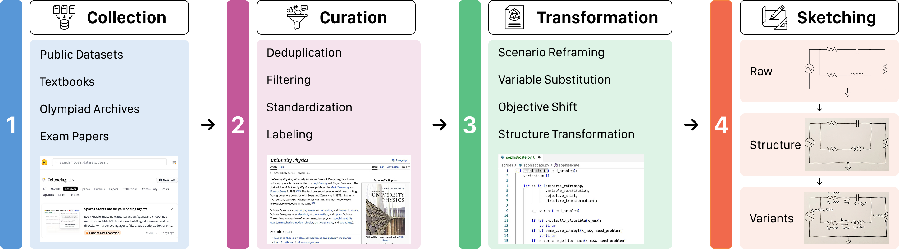
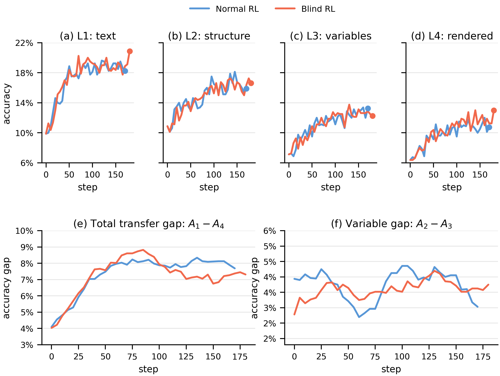
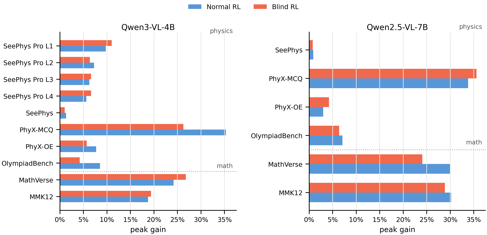
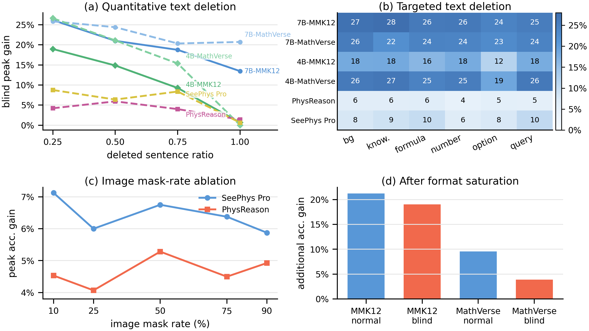

<h1 align="center">SeePhys Pro</h1>

<p align="center">
  <b>Diagnosing Modality Transfer and Blind-Training Effects in Multimodal RLVR for Physics Reasoning</b>
</p>

<p align="center">
  <a href="https://arxiv.org/abs/2605.09266"></a>
  <a href="https://seephyspro.github.io"></a>
  <a href="https://huggingface.co/datasets/Kun-Xiang/PhysRL"></a>
  <a href="https://huggingface.co/datasets/Kun-Xiang/SeePhysPro"></a>
  <a href="https://www.codabench.org/competitions/16010/"></a>
</p>

<p align="center">
  <a href="https://arxiv.org/abs/2605.09266">Paper</a> |
  <a href="https://seephyspro.github.io">Project Page</a> |
  <a href="https://ai4math2026.github.io/">Workshop</a> |
  <a href="https://www.codabench.org/competitions/16010/">Challenge</a> |
  <a href="https://huggingface.co/datasets/Kun-Xiang/PhysRL">Training Set</a> |
  <a href="https://huggingface.co/datasets/Kun-Xiang/SeePhysPro">Benchmark</a>
</p>

## News

- [2026.05.13] We release the official
  [code](https://github.com/AI4Phys/SeePhy-Pro) for SeePhys Pro.
- [2026.05.13] The [arXiv paper](https://arxiv.org/abs/2605.09266) and
  [project page](https://seephyspro.github.io) are online.
- [2026.05.13] We release the [PhysRL training set](https://huggingface.co/datasets/Kun-Xiang/PhysRL)
  and [SeePhys Pro benchmark](https://huggingface.co/datasets/Kun-Xiang/SeePhysPro)
  on Hugging Face.
- [2026.05.13] SeePhys Pro is included as
  [Challenge 3](https://www.codabench.org/competitions/16010/) at the
  [3rd AI for Math Workshop at ICML 2026](https://ai4math2026.github.io/).

## Overview

SeePhys Pro is a fine-grained modality-transfer benchmark for multimodal physics
reasoning. Each seed problem is converted into four semantically aligned forms
that progressively move task-critical information from language into images:

- **L1:** text-only problem statement.
- **L2:** physical structure is moved into the image.
- **L3:** variables and labels must be grounded visually.
- **L4:** the full problem is rendered as visual input.

This repository provides the code used for benchmark inference, judging, and
the RLVR training diagnostics in the paper. 

## Highlights

- **Progressive modality transfer.** We introduce SeePhys Pro, a physics
  reasoning benchmark built on the principle of same physics, different
  representation. Its four aligned levels decompose model performance into
  structural transfer, visual variable grounding, full-rendering effects, and
  representation consistency.
- **Frontier-model diagnostic.** We evaluate strong closed- and open-weight
  MLLMs and find that even frontier systems remain fragile when task-critical
  information moves from text into diagrams, especially when variables and
  labels must be read from images.
- **PhysRL training corpora.** We release source-matched, benchmark-disjoint
  PhysRL training data for reproducing physics RLVR experiments and comparing
  normal RL with controlled variants across 4B and 7B models.
- **Blind-training observation.** We use masked-image RL as a negative-control
  diagnostic and observe that blind training can still improve unmasked
  validation accuracy. Our analysis suggests that residual language, templates,
  answer priors, and dataset regularities can drive part of the gain, so
  accuracy gains alone should not be taken as evidence of stronger visual
  grounding.

## Core Conclusions

- **Best current model.** Gemini-3.1-Pro has the highest L1-L4 average accuracy
  among the listed systems, followed by Claude-4.7-Opus and GPT-5.4.
- **Primary evaluation bottleneck.** Across the aggregate row, accuracy drops
  from 49.2% on L1 to 35.8% on L4, with the largest mean gap at L2 -> L3 where
  variables and labels must be grounded from images.
- **Training-time warning.** PhysRL improves validation accuracy, but normal RL
  and blind RL do not reliably close modality-transfer gaps; reporting only
  final-answer accuracy can therefore overstate visually grounded learning.

### Main Leaderboard

| Rank | Model | Avg. | L1 | L2 | L3 | L4 | Cons4 | Delta-S | Delta-V | Delta-R | Delta-T |
| --- | --- | ---: | ---: | ---: | ---: | ---: | ---: | ---: | ---: | ---: | ---: |
| **Human** | **Human Performance** | **57.0** | **54.0** | **58.5** | **59.5** | **56.0** | **49.0** | **-4.5** | **-1.0** | **3.5** | **-2.0** |
| 1 🥇 | Gemini-3.1-Pro | 69.0 | 71.0 | 72.0 | 66.5 | 66.5 | 47.0 | -1.0 | 5.5 | 0.0 | 4.5 |
| 2 🥈 | Claude-4.7-Opus | 61.0 | 74.0 | 67.0 | 56.5 | 46.5 | 33.5 | 7.0 | 10.5 | 10.0 | 27.5 |
| 3 🥉 | GPT-5.4 | 60.1 | 67.4 | 64.1 | 55.8 | 53.0 | 32.6 | 3.3 | 8.3 | 2.8 | 14.4 |
| 4 | Qwen-3.6-flash | 54.8 | 61.4 | 59.3 | 49.9 | 48.4 | 29.9 | 2.1 | 9.4 | 1.5 | 13.0 |
| 5 | Qwen3.5-27B | 33.4 | 45.0 | 34.8 | 28.0 | 25.6 | 9.9 | 10.3 | 6.8 | 2.4 | 19.4 |
| 6 | GPT-5 | 30.4 | 41.8 | 32.9 | 23.8 | 23.2 | 8.9 | 8.9 | 9.1 | 0.5 | 18.5 |
| 7 | Gemma-4-31B-it | 29.6 | 38.9 | 33.5 | 23.9 | 22.0 | 8.9 | 5.4 | 9.6 | 1.9 | 16.9 |
| - | Aggregate Average | 42.5 | 49.2 | 46.1 | 38.7 | 35.8 | 21.4 | 3.0 | 7.4 | 2.9 | 13.4 |

**Table 1. Main SeePhys Pro leaderboard.** Values follow the current project
page. The highlighted Human Performance row is shown first as a reference and
is not included in model ranks. Avg. is the mean of L1-L4 accuracy; ranked model
rows are sorted by Avg., and the aggregate row is kept at the bottom for
reference. L1-L4 and Cons4 are percentages; positive transfer gaps indicate
degradation under a more visual representation. Delta-S, Delta-V, and Delta-R
measure L1 -> L2 structural transfer, L2 -> L3 variable grounding, and L3 -> L4
rendering gaps; Delta-T is the overall L1 -> L4 gap.

**Takeaway.** Gemini-3.1-Pro leads by L1-L4 average accuracy, while
Claude-4.7-Opus has the strongest L1 score but a much larger overall transfer
gap. The aggregate row still drops from 49.2% on L1 to 35.8% on L4, with
Delta-V as the largest mean component.

### Benchmark Design

<p align="center">
  
</p>

<p align="center"><b>Figure 1.</b> Four modality-transfer levels in SeePhys Pro.</p>

**Takeaway.** The benchmark keeps the underlying physics fixed while moving
structure, variables, and finally the full statement into vision. This makes it
possible to diagnose where a model loses invariance instead of reporting only a
single final score.

### Data Pipeline

<p align="center">
  
</p>

<p align="center"><b>Figure 2.</b> Data pipeline for constructing SeePhys Pro.</p>

**Takeaway.** Problems are curated from heterogeneous physics sources, cleaned,
deduplicated, transformed, and manually sketched into aligned levels. The result
is a controlled modality-transfer benchmark rather than a loose collection of
unrelated visual questions.

### Training Diagnostic

<p align="center">
  
</p>

<p align="center"><b>Figure 3.</b> Normal and blind RL diagnostics on SeePhys Pro.</p>

**Takeaway.** Normal RL and blind RL both improve absolute accuracy, but the
total transfer gap and the variable-grounding gap remain large. Accuracy gains
therefore do not automatically mean that the model has learned to use the
task-critical visual evidence.

### Cross-Benchmark Control

<p align="center">
  
</p>

<p align="center"><b>Figure 4.</b> Cross-benchmark normal and blind RL gain summary.</p>

**Takeaway.** Blind-training gains also appear on external physics and math
benchmarks, and in several settings recover a large fraction of normal-RL gains.
This points to residual language, templates, answer priors, and dataset-level
regularities as plausible non-visual learning routes.

### Mechanism Controls

<p align="center">
  
</p>

<p align="center"><b>Figure 5.</b> Mechanism controls for blind-training gains.</p>

**Takeaway.** Text deletion, targeted deletion, mask-rate ablations, and
format-saturation controls weaken simple explanations such as all-black-image
artifacts or format-only learning. The blind signal is better understood as a
distributed shortcut effect from residual textual and distributional cues.

## Quick Start

### Benchmark Evaluation Environment

Python 3.10-3.12 is recommended.

```bash
conda create -n seephyspro-eval python=3.10 -y
conda activate seephyspro-eval

cd lmms-eval
pip install -U pip
pip install -e .
```

### Download Benchmark Data

The SeePhys Pro `lmms-eval` tasks expect Level 1-4 parquet files under
`lmms-eval/data/seephys_pro/`:

```bash
cd lmms-eval
mkdir -p data/seephys_pro data/seephys_pro_raw

huggingface-cli download Kun-Xiang/SeePhysPro \
  --repo-type dataset \
  --local-dir data/seephys_pro_raw

for level in level1 level2 level3 level4; do
  cp "data/seephys_pro_raw/${level}/train-00000-of-00001.parquet" \
     "data/seephys_pro/${level}-00000-of-00001.parquet"
done
```

### Run Benchmark Evaluation

Local open-model evaluation:

```bash
cd lmms-eval
python -m lmms_eval eval --config configs/seephys_pro_local.yaml
```

Closed-model or OpenAI-compatible evaluation:

```bash
cd lmms-eval
export OPENAI_API_KEY="<your_api_key>"
python -m lmms_eval eval --config configs/seephys_pro_api.yaml
```

Common task entry points:

```text
seephys_pro_all
seephys_pro_level1
seephys_pro_level2
seephys_pro_level3
seephys_pro_level4
seephys_pro_testmini
```

## RLVR Training

Use a Linux CUDA environment for training. Install the PyTorch build matching
your CUDA driver before installing EasyR1 dependencies, because `flash-attn`
requires `torch` at build time.

```bash
conda create -n seephyspro-rl python=3.10 -y
conda activate seephyspro-rl

cd EasyR1
pip install -U pip

# Replace cu124 if your cluster uses another CUDA version.
pip install torch torchvision --index-url https://download.pytorch.org/whl/cu124

pip install -r requirements.txt --no-build-isolation
pip install -e . --no-build-isolation
```

Run the retained reproduction launchers:

```bash
cd EasyR1

# PhysRL physics training
bash examples/repro/physrl_4b_normal.sh
bash examples/repro/physrl_4b_blind.sh
bash examples/repro/physrl_7b_normal.sh
bash examples/repro/physrl_7b_blind.sh

# Visual-math control
bash examples/repro/math_vn_4b_normal.sh
bash examples/repro/math_vn_4b_blind.sh
bash examples/repro/math_vn_7b_normal.sh
bash examples/repro/math_vn_7b_blind.sh
```

Blind RL is used as a negative-control diagnostic. It masks only training
images:

```text
data.train_image_mask_mode=all_blank
```

Validation images remain unmasked. Dataset placeholders can be overridden at
runtime:

```bash
PHYSRL_TRAIN_FILES="<your_physrl_train_split>" \
PHYSICS_VAL_FILES="<name1=validation_split1,name2=validation_split2>" \
MODEL_PATH="Qwen/Qwen3-VL-4B-Instruct" \
GPUS=4 \
NNODES=1 \
bash examples/repro/physrl_4b_normal.sh
```

The main reproduction configs use 4 rollouts per prompt, rollout temperature
1.0, top-p 1.0, 4096 prompt tokens, 4096 response tokens, AdamW learning rate
`1e-6`, weight decay `0.01`, one PPO epoch, BF16 FSDP, vLLM rollout, and
validation every 5 iterations.

## Notes

- API credentials should be provided through environment variables; do not
  hard-code keys in configs or scripts.
- Some training configs use sanitized dataset placeholders. Override them with
  the PhysRL and validation splits used in your environment.
- For SeePhys Pro, report `A1`-`A4`, transfer gaps, and consistency. Final
  accuracy alone is not sufficient for diagnosing visual grounding.
- This release excludes private keys, `.env` files, local user paths, `.git`
  directories, temporary scripts, cache files, and OS metadata.

## Citation

```bibtex
@article{xiang2026seephyspro,
  title   = {SeePhys Pro: Diagnosing Modality Transfer and Blind-Training Effects in Multimodal RLVR for Physics Reasoning},
  author  = {Xiang, Kun and Zhang, Terry Jingchen and Liu, Zirong and Zhou, Bokai and Tang, Yueling and Yu, Junjie and Lu, Jiacong and Huang, Shangrui and Li, Heng and Zhang, Likui and Liu, Kunkun and Zhang, Changzheng and Fang, Yangle and Guo, Boqiang and Zhen, Hui-Ling and Tu, Dandan and Huang, Yinya and Liang, Xiaodan},
  journal = {arXiv preprint arXiv:2605.09266},
  year    = {2026},
  url     = {https://arxiv.org/abs/2605.09266}
}
```

## Acknowledgements

This release builds on
[lmms-eval](https://github.com/EvolvingLMMs-Lab/lmms-eval),
[EasyR1](https://github.com/hiyouga/EasyR1), and
[veRL](https://github.com/volcengine/verl).
